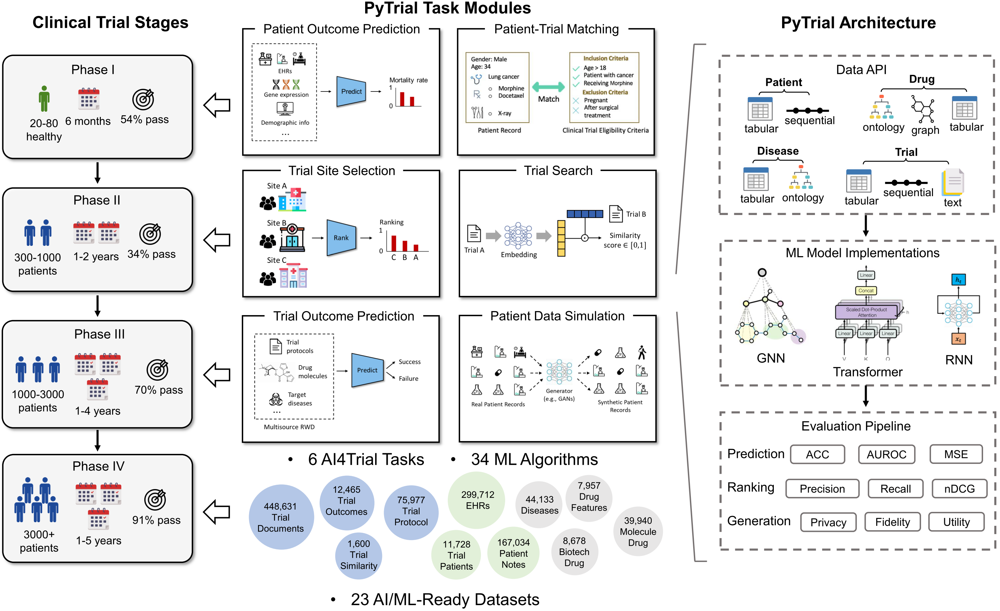

<h2 align='center'>
    PyTrial
</h2>

<h4 align='center'>
PyTrial: A Python Package for Artificial Intelligence in Drug Development
</h4>

<div align='center'>

[](https://pytrial.readthedocs.io/en/latest/)
[](https://pytrial.readthedocs.io/en/latest/tutorial.html)

[](https://pepy.tech/project/pytrial)
[](https://opensource.org/licenses/BSD-2-Clause)
[](https://www.python.org/downloads/release/python-370/)
[](https://www.sunlab.org/)

</div>

<figure>

<figcaption align = "center"> 
A series of clinical trial tasks that are supported by PyTrial.
</figcaption>
</figure>


## :star: Features

**PyTrial** is designed for both ML researchers and medical practioners, which is featured for

- :key: Off-the-shelf pipelines for various clinical trial tasks proposed in the most recent top-venue papers.

- :fire: A comprehensive implementation of many AI for drug development tasks:
	- [Patient outcome prediction](https://pytrial.readthedocs.io/en/latest/pytrial.tasks.indiv_outcome.html).
	- [Trial site selection](https://pytrial.readthedocs.io/en/latest/pytrial.tasks.site_selection.html).
	- [Trial outcome prediction](https://pytrial.readthedocs.io/en/latest/pytrial.tasks.trial_outcome.html).
	- [Patient-trial matching](https://pytrial.readthedocs.io/en/latest/pytrial.tasks.trial_patient_match.html).
	- [Trial similarity search](https://pytrial.readthedocs.io/en/latest/pytrial.tasks.trial_search.html).
	- [Trial data simulation](https://pytrial.readthedocs.io/en/latest/pytrial.tasks.trial_simulation.html).

- :book: Unified APIs, detailed [documentation](https://pytrial.readthedocs.io/en/latest/index.html), and [interactive examples](https://pytrial.readthedocs.io/en/latest/tutorial.html) with preprocessed demo data for every implemented algorithm.

- :bulb: Cutting-edge AI4Trial algorithms reproduced from the most recent top-venue papers.

- :airplane: Scalability to future research and development based on the **PyTrial**'s architecture.


## :rocket: Installation

- Before install PyTrial, we need to install pytorch first. Please refer to [install PyTorch](https://pytorch.org/get-started/locally/) for a version that suits your device.

- Then, it is easy to install PyTrial from github source:

```bash
pip install git+https://github.com/RyanWangZf/pytrial.git@main
```

The package is tested on ``python==3.7``.

We **DO NOT** recommend downloading from PyPI temporarily because PyTrial is undergoing development swiftly.


## :sunny: Philosophy
> In PyTrial, performing a task boils down to three steps: load data -> define model -> fit and predict.

To minimize the efforts learning to use PyTrial, we keep a consistent user interface for all tasks all models, i.e.,

```python
model.fit(train_data, val_data)

model.predict(test_data)

model.save_model(save_dir)

model.load_model(load_dir)
```

hence all tasks are defined the *input* and *output*. All we need to do is to prepare for the input following the protocol.


## :book: Documentation

>We provide the following tutorials to help users get started with our PyTrial. After go through all these chapters, you will become the expert in AI for clinical trials and are ready to explore the frontier of this field.

The full documentation is at [PyTrial-docs](https://pytrial.readthedocs.io/en/latest/).


### The principle of PyTrial

- [Intro 1: Overview of PyTrial](https://pytrial.readthedocs.io/en/latest/tutorials/overview.html)
- [Intro 2: PyTrial API & Pipeline](https://pytrial.readthedocs.io/en/latest/tutorials/pipeline.html)
- [Intro 3: Basic Patient Data Class](https://pytrial.readthedocs.io/en/latest/tutorials/inputdata.patient.html)
- [Intro 4: Basic Trial Data Class](https://pytrial.readthedocs.io/en/latest/tutorials/inputdata.trial.html)


### Tutorials for each task

- [Task 1: Individual Patient Outcome Prediction](https://pytrial.readthedocs.io/en/latest/tutorials/indiv_outcome/indiv_outcome.html) 
- [Task 2: Clinical Trial Site Selection](https://pytrial.readthedocs.io/en/latest/tutorials/site_selection/site_selection.html)
- [Task 3: Trial Outcome Prediction](https://pytrial.readthedocs.io/en/latest/tutorials/trial_outcome/trial_outcome.html)
- [Task 4: Patient-Trial Matching](https://pytrial.readthedocs.io/en/latest/tutorials/trial_patient_match/trial_patient_match.html)
- [Task 5: Trial Similarity Search](https://pytrial.readthedocs.io/en/latest/tutorials/trial_search/trial_search.html)
- [Task 6: Trial Patient Records Simulation](https://pytrial.readthedocs.io/en/latest/tutorials/trial_simulation/trial_simulation.html)


### Additional utilities

- [Misc 1: Load Preprocessed Demo Data](https://pytrial.readthedocs.io/en/latest/tutorials/load_demo_data.html)
- [Misc 2: Prepare Oncology Trial Patient Data](https://pytrial.readthedocs.io/en/latest/tutorials/trial_patient_data.html)
- [Misc 3: Pretrained BERT Model](https://pytrial.readthedocs.io/en/latest/tutorials/pretrained_bert.html)
- [Misc 4: ICD9 & 10 Knowledge Graph](https://pytrial.readthedocs.io/en/latest/tutorials/icd_kg.html)
- [Misc 5: Drug Knowledge Graph](https://pytrial.readthedocs.io/en/latest/tutorials/drug_kg.html)


## :smiley: Citing 

If you use PyTrial in a scientific publication, we would appreciate citations to:

```bibtex
@misc{pytrial2022,
    title = {PyTrial: A Python Package for Artificial Intelligence in Drug Development},
    author = {Wang, Zifeng and Theodorou, Brandon and Fu, Tianfan and Sun, Jimeng},
    year = {2022},
    month = {11},
    organization = {SunLab, UIUC},
    url = {https://pytrial.readthedocs.io/en/latest/},
}
```


