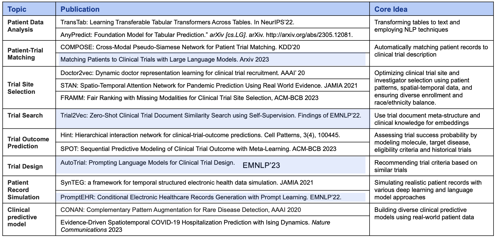

Welcome to PyTrial documentation!
==================================

`PyTrial` is an easy-to-use **Python package** for a series of AI for drug development tasks. **Clinical trial** is the major step of the drug development process, where phase I, II, III, & IV trials are performed to comprehensively evaluate the 
efficacy and safety of a new drug.

`PyTrial` is featured for the following tasks and we are adding more!

* **Patient outcome prediction**: predict the patient outcomes using tabular or sequential patient data.
* **Trial site selection**: pick the best trial sites considering multiple objectives.
* **Trial outcome prediction**: predict the trial outcomes using tabular or sequential trial data.
* **Patient-trial matching**: match trials' elibility criteria to patients' EHRs for participant recruitment of clinical trials.
* **Trial similarity search**: encode and retrieve similar clinical trials based on trial design documents.
* **Trial data simulation**: generate synthetic EHRs or trial patient records in table or sequence.

.. figure:: ../images/pytrial_tasks.png
   :width: 800
   :align: center

   The demonstration of clinical trial tasks supported by PyTrial.

The package is developed based on our extensive research in AI for clinical trials over several years. Here is a list of select papers.

   The list of select papers that PyTrial is based on.

If you find this package useful, please consider citing it in your scientific publications:

.. code:: latex

   @article{wang2023pytrial,
     title={PyTrial: Machine Learning Software and Benchmark for Clinical Trial Applications},
     author={Wang, Zifeng and Theodorou, Brandon and Fu, Tianfan and Xiao, Cao and Sun, Jimeng},
     journal={arXiv preprint arXiv:2306.04018},
     year={2023}
   }

----

.. toctree::
   :maxdepth: 2
   :hidden:
   :caption: Getting Started

   install
   tutorial

.. toctree::
    :maxdepth: 2
    :hidden:
    :caption: Documentation

    data<data>
    tasks.indiv_outcome<pytrial.tasks.indiv_outcome>
    tasks.site_selection<pytrial.tasks.site_selection>
    tasks.trial_outcome<pytrial.tasks.trial_outcome>
    tasks.trial_patient_match<pytrial.tasks.trial_patient_match>
    tasks.trial_search<pytrial.tasks.trial_search>
    tasks.trial_simulation<pytrial.tasks.trial_simulation>
    model_utils<pytrial.model_utils>
    utils<pytrial.utils>

.. toctree::
    :maxdepth: 2
    :hidden:
    :caption: Additional Information

    about
