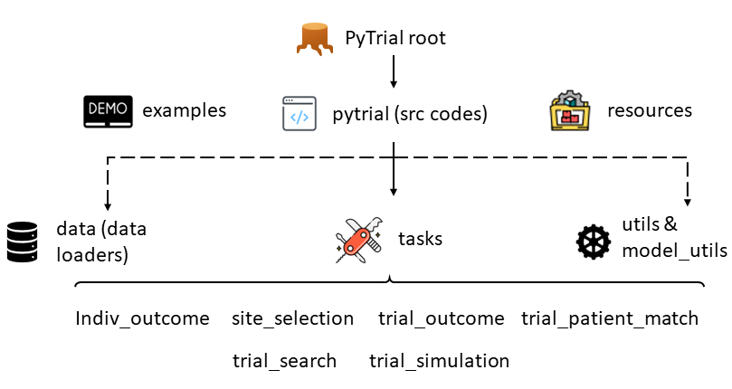

Overview of PyTrial
===================

.. contents:: Table of Contents
    :depth: 2

As the first chapter of the tutorial, we want to deliver the basic idea of how we design **PyTrial** in order to help deploy artificial intelligence (AI) algorithms in the real-world drug development process.

Principle: Input & Output Define the Task
-----------------------------------------

We believe the top priority is to ensure that PyTrial is **easy-to-use**. We are committed to developing a pipeline for each task with *a couple lines of codes*, for example,

.. code:: python

    # import the model
    from pytrial.tasks.indiv_outcome.tabular import transtab

    # initialize the model
    model = transtab()

    # fit the model
    model.fit(train_data, valid_data)

    # predict the outcome
    model.predict(test_data)

    # save the model to disk
    model.save_model('./checkpoints')

Without vagueness, this pipeline has an intuitive logic for all machine learning people. We try to keep this interface as simple as possible and its style consistent across **all tasks and models**. That is to say,
all models should have the same common functions like ``fit``, ``predict``, ``save_model``, ``load_model``, etc. In this way, users can easily switch between different tasks and models without any extra effort to study the interface.

The only thing that remains to care about is then the ``input`` and ``output`` of the model, 
which defines the task.

Code Hierarchy
--------------

    The hierarchy of PyTrial source codes, corresponds to the one in https://github.com/RyanWangZf/PyTrial.

The hierarchy of the PyTrial repository is illustrated by the above figure. On the first layer, 
we have the ``pytrial`` folder, which contains all the source codes of PyTrial. The other two are the ``examples`` that store
the jupyter notebook examples for each model and the ``resources`` folder that stores some tools and preprocessed data.

In most scenarios, users only need to use the ``pytrial`` folder. The ``examples`` folder is for users who want to learn how to use PyTrial. The ``resources`` folder is for developers who want to add new models or tasks to PyTrial.

Specifically, the ``pytrial`` folder contains the following subfolders:

- :doc:`indiv_outcome <../pytrial.tasks.indiv_outcome>`: contains the source codes for individualized outcome prediction tasks.
- :doc:`site_selection <../pytrial.tasks.site_selection>`: contains the source codes for site selection tasks.
- :doc:`trial_outcome <../pytrial.tasks.trial_outcome>`: contains the source codes for trial outcome prediction tasks.
- :doc:`trial_patient_match <../pytrial.tasks.trial_patient_match>`: contains the source codes for trial patient matching tasks.
- :doc:`trial_search <../pytrial.tasks.trial_search>`: contains the source codes for trial search tasks.
- :doc:`trial_simulation <../pytrial.tasks.trial_simulation>`: contains the source codes for trial patient record simulation tasks. 

We will play with the models under each task folder, e.g., ``trial_search.trial2vec``. In some cases,
the task has its specific input format, for instance, the patient-trial matching task requires input patient and
trial data in the form of ``trial_patient_match.data.PatientData`` and ``trial_patient_match.data.TrialData``, respectively.

Don't worry, we will go through these tasks one by one with concrete examples!

